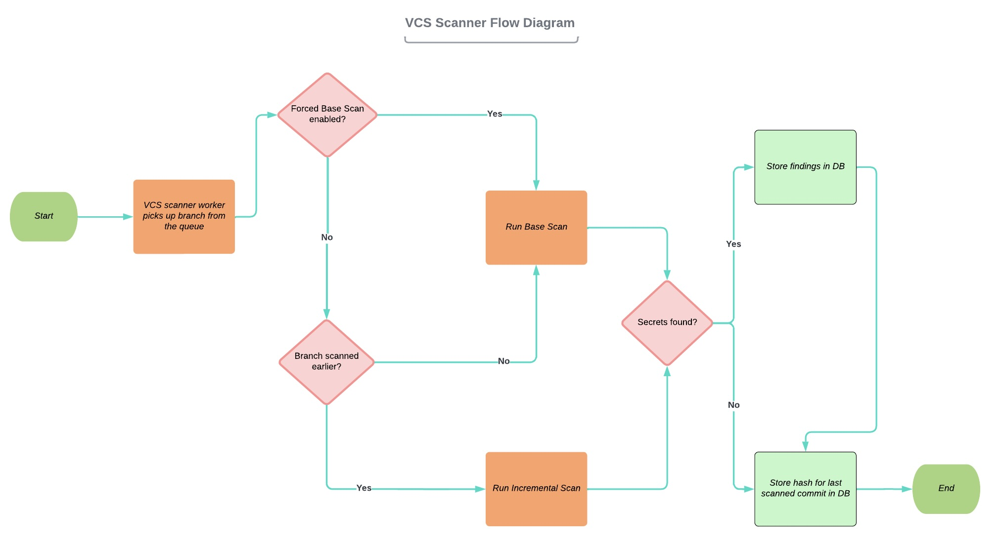

                  
            ______                     _ _                     _____
            | ___ \                   (_| |                   /  ___|
            | |_/ /___ _ __   ___  ___ _| |_ ___  _ __ _   _  \ `--.  ___ __ _ _ __  _ __   ___ _ __
            |    // _ | '_ \ / _ \/ __| | __/ _ \| '__| | | |  `--. \/ __/ _` | '_ \| '_ \ / _ | '__|
            | |\ |  __| |_) | (_) \__ | | || (_) | |  | |_| | /\__/ | (_| (_| | | | | | | |  __| |
            \_| \_\___| .__/ \___/|___|_|\__\___/|_|   \__, | \____/ \___\__,_|_| |_|_| |_|\___|_|
                      | |                               __/ |
                      |_|                              |___/

    <h1>Repository Scanner</h1>
    <h3>
        
        
        
        
    </h3>

The Repository Scanner (RESC) is a tool used to detect secrets in source code management and version control systems 
(e.g. GitHub, BitBucket, or Azure DevOps). Among the types of secrets that the Repository Scanner detects are credentials, 
passwords, tokens, API keys, and certificates. The tool is maintained and updated by the ABN AMRO Bank to match the 
constantly changing cyber security landscape. 

The Repository Scanner was created to prevent that credentials and other sensitive information are left unprotected in code repositories.
Exposing sensitive information in such a way can have severe consequences for the security posture of an organization. An attacker can use 
the data to compromise the organization's network. This can be prevented by scanning a repository with the RESC tool. It marks all the 
instances of exposed sensitive information in the source code.

## 📒 Table of contents
* [Links](#links)
* [Versions](#versions)
* [Technical information](#technical-information)
* [Getting started](#getting-started)
* [Dummy data generation](#dummy-data-generation-guide)
* [Contributing guidelines](#contribution-guide)
* [Contact](#contact)
* [License](#license)
* [Acknowledgments](#acknowledgement)

## 🔗 Links 

Throughout the process of open sourcing this project, the ABN AMRO Bank created a series of articles that describe the
capabilities of the Repository Scanner (RESC) tool, the architectural decisions behind it, and the road to open sourcing 
RESC. With the articles, users can look "behind the scenes" and gain a deeper understanding of the tool. 

## ⚙️ Versions 
The [SemVer](https://semver.org/) numbering is used for the releases of the Repository Scanner tool. A version
consists of a MAJOR.MINOR.PATCH number (e.g. v1.2.4): 
- The **MAJOR** part is reserved for updates that: 
  - alter the flow and behavior of the tool. 
  - noticeably impact the user experience. 
  
- The **MINOR** part of the number focuses on:
  - big new features. 
  - feature updates. 
  - other newsworthy changes in the tool. 
   
 - The **PATCH** part captures all other changes: 
   - small content edits. 
   - bug fixes. 
   - information corrections.
   - updated broken links.

### Releases
Every notable release of the Repository Scanner tool, the changes that come with the release, and the release date can be found on the [Releases](https://github.com/abnamro/repository-scanner/releases) page.

## 🛠️ Technical information 
The technologies that the Repository Scanner Tool is built on is listed below. There is also a list with direct links to the individual
components of RESC.

* [![Python][Python.org]][Python-url]
* [![Docker][Docker.com]][Docker-url]
* [![Kubernetes][Kubernetes.io]][Kubernetes-url]
* [![Helm][Helm.sh]][Helm-url]
* [![Vue][Vue.js]][Vue-url]
* [![RabbitMQ][RabbitMQ.com]][RabbitMQ-url]
* [![Redis][Redis.com]][Redis-url]

### VCS Scanner Worker flow diagram
The flow diagram below shows the different stages that a VCS Scanner Worker goes through and the choices it is confronted with to
come to the desired result. It first picks up a repository from the queue where it is decided, in conjunction with user input, what type of scan to run. 
If it is a base scan, a full scan of all commits will be carried out to look for secrets. Possible findings are stored inside the database along with the last scanned commit hash of the repository. An incremental scan, where the repository was scanned earlier, only looks at the commits that were made after the last scanned commit hash. The process of finding secrets and storing them in the database is similar as previously described. 

### RESC high-level overview
The diagram below gives a high-level overview of the Repository Scanner tool. All the different components of the
tool and the technologies that it utilizes are explained in detail here. As shown in the diagram, all the components mentioned
are run as Docker containers in a Kubernetes ecosystem.

* [RESC-Frontend](https://github.com/abnamro/repository-scanner/tree/main/components/resc-frontend): The RESC-Frontend is a fully responsive dashboard application developed using Vue.js 2 and the BootstrapVue framework. It has screens for Analytics, Repositories, Scan Findings, Rule Analytics, and Rule Pack.
* [RESC-Backend](https://github.com/abnamro/repository-scanner/tree/main/components/resc-backend): The RESC-Backend is the backend of the Repository Scanner tool. The RESC-Backend consists of RabbitMQ users and queue creation, Database models, the RESC Web service, and Alembic scripts for database migration. The RESC Web service is created using FASTAPI.
* [RESC-VCS-Scanner](https://github.com/abnamro/repository-scanner/tree/main/components/resc-vcs-scanner): RESC-VCS-Scanner, which runs as a celery worker, gathers repositories from the repositories queue and carries out a secret scan. Gitleaks is used as the scanner to find secrets.
* [RESC-VCS-Scraper](https://github.com/abnamro/repository-scanner/tree/main/components/resc-vcs-scraper): All projects and repositories from supported VCS providers such as Bitbucket, Azure Repos, and GitHub are gathered by the RESC-VCS-SCRAPER. This component contains the VCS-Scraper-Projects and VCS-Scraper-Repositories as its primary modules.

## 🛠️ Getting started 
The instructions below help you to get a copy of the project up and running on your local machine for development and testing purposes.  
* Running RESC  
[Deployment through helm](https://github.com/abnamro/repository-scanner/tree/main/deployment/kubernetes)  

* Running individual components  
[RESC-BACKEND](https://github.com/abnamro/repository-scanner/tree/main/components/resc-backend)  
[RESC-VCS-SCRAPER](https://github.com/abnamro/repository-scanner/tree/main/components/resc-vcs-scraper)  
[RESC-VCS-SCANNER](https://github.com/abnamro/repository-scanner/tree/main/components/resc-vcs-scanner)  
[RESC-FRONTEND](https://github.com/abnamro/repository-scanner/tree/main/components/resc-frontend)  

##  Dummy data generation 
A standalone utility to generate dummy data for testing purposes is located at `./components/resc_backend/src/resc_backend/bin/dummy-data-generator`. More details can be found [here](./components/resc-backend/src/resc_backend/bin/dummy-data-generator/README.md)

## 💁🏽 Contributing guidelines 
We believe that innovating together can lead to the most incredible results and developments. Contributions to the Repository Scanner tool are therefore highly encouraged. We have created [guidelines](https://github.com/abnamro/repository-scanner/blob/main/contributing.md) that we expect contributors to the project to follow.  By contributing to the project you also agree with our [Code of Conduct](https://github.com/abnamro/repository-scanner/blob/main/code-of-conduct.md).

## 📧    Contact 
If you need to get in touch with the maintainers of the Repository Scanner tool, please use the following e-mail address: [resc@nl.abnamro.com](mailto:resc@nl.abnamro.com).

## ⚖️ License 
The Repository Scanner (RESC) Tool is licensed under the [MIT](https://github.com/abnamro/repository-scanner/blob/main/LICENSE.md) License.

<!-- MARKDOWN LINKS & IMAGES -->
<!-- https://www.markdownguide.org/basic-syntax/#reference-style-links -->
[Python.org]: https://img.shields.io/badge/Python-2b5b84?style=for-the-badge&logo=python&logoColor=white
[Python-url]: https://www.python.org/
[Docker.com]: https://img.shields.io/badge/Docker-0b214a?style=for-the-badge&logo=docker&logoColor=white
[Docker-url]: https://www.docker.com/
[Kubernetes.io]: https://img.shields.io/badge/Kubernetes-3371e3?style=for-the-badge&logo=kubernetes&logoColor=white
[Kubernetes-url]: https://www.kubernetes.io/
[Helm.sh]: https://img.shields.io/badge/Helm-091c84?style=for-the-badge&logo=helm&logoColor=white
[Helm-url]: https://helm.sh/
[Vue.js]: https://img.shields.io/badge/Vue.js-35495E?style=for-the-badge&logo=vuedotjs&logoColor=4FC08D
[Vue-url]: https://vuejs.org/
[RabbitMQ.com]: https://img.shields.io/badge/RabbitMQ-ff6600?style=for-the-badge&logo=rabbitmq&logoColor=white
[RabbitMQ-url]: https://rabbitmq.com/
[Redis.com]: https://img.shields.io/badge/redis-%23DD0031.svg?&style=for-the-badge&logo=redis&logoColor=white
[Redis-url]: https://redis.com/

## 🎉 Acknowledgements 
Since the Repository Scanner (RESC) makes use of [GitLeaks](https://github.com/zricethezav/gitleaks), we want to give Zachary Rice credits for creating and maintaining GitLeaks. GitLeaks has helped many organizations in securing their codebases for any leaked secrets.
