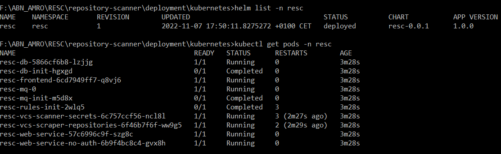
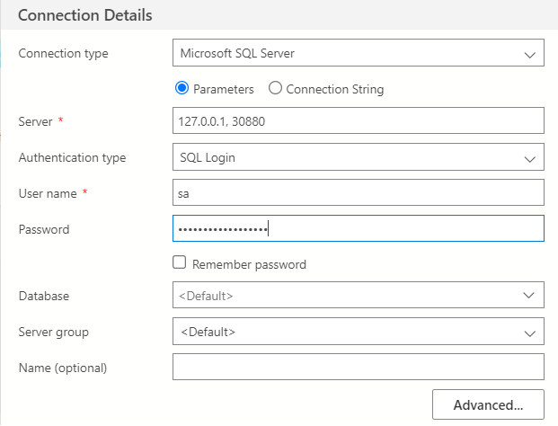

# Repository Scanner (RESC) Deployment - Kubernetes
[![Docker][docker-shield]][docker-url]
[![Kubernetes][k8-shield]][k8-url]
[![Helm][helm-shield]][helm-url]
[![CI][ci-shield]][ci-url]

<!-- TABLE OF CONTENTS -->
## Table of contents
1. [About the component](#about-the-component)
2. [Technology stack](#technology-stack)
3. [Getting started](#getting-started)
    - [Prerequisites](#prerequisites)
    - [Testing templates](#testing-templates)
    - [Deploying charts manually](#deploying-charts-manually)
    - [Github as Helm Chart Repository](#github-as-helm-chart-repository)
4. [Additional Information](#additional-information)
    - [Trigger scanning](#trigger-scanning)
    - [Connect to database using Azure Data Studio](#connect-to-database-using-azure-data-studio)


<!-- ABOUT THE COMPONENT -->
## About the component
This component contains templates and charts for deploying the Repository Scanner in a Kubernetes infrastructure.

<!-- TECHNOLOGY STACK -->
## Technology stack
* [Docker](https://www.docker.com/)
* [Kubernetes](https://kubernetes.io/)
* [Helm](https://helm.sh/)

<!-- GETTING STARTED -->
## Getting started

These instructions will help you to get a copy of the project up and running on your local machine for development and testing purposes.
For an interactive easy deployment of RESC on Kubernetes cluster, please refer [resc-helm-wizard](https://github.com/abnamro/repository-scanner/blob/main/deployment/resc-helm-wizard/README.md).

### Prerequisites
#### 1. Install Software
* [Docker Desktop](https://www.docker.com/products/docker-desktop/)
* [Kubernetes](https://docs.docker.com/desktop/kubernetes/) - To install Kubernetes, enable it in Docker Desktop. If you install Kubernetes using minikube, ensure the version is 1.21 or later.
* [Helm](https://helm.sh/docs/intro/install/)

 
#### 2. Populate RESC-RULE.toml file
RESC uses rules from [Gitleaks](https://github.com/zricethezav/gitleaks) to detect secrets.
Ensure you have the rule pack config file in TOML format available, which needs to be provided as deployment argument.
To download this GitLeaks rule you need to execute the following command in a Git Bash or Linux terminal:

```bash
cd ./deployment/kubernetes/

curl https://raw.githubusercontent.com/zricethezav/gitleaks/master/config/gitleaks.toml > RESC-RULE.toml
```

#### 3. Populate custom-values.yaml file

Run the interactive CLI wizard to populate custom-values.yaml and run the deployment.
Detailed information can be found [here](https://github.com/abnamro/repository-scanner/blob/main/deployment/resc-helm-wizard/README.md)

#### 4. Manual configuration for values.yaml file (Optional)
<details>
  <summary>Preview</summary>
  
  #### 1. Create persistent volume and update it in custom-values.yaml
Create two folders in your user folder and name them _database_ and _rabbitmq_ as described below.

Windows: C:\Users\<username>\resc\database and C:\Users\<username>\resc\rabbitmq  
Linux: /Users/<username>/var/resc/database and /Users/<username>/var/resc/rabbitmq

Update persistent volume claim path and filemountType for database.
```
Windows:
--------------
resc-database:
  filemountType: "windows"
  database:
    pvc_path: "/run/desktop/mnt/host/c/Users/<username>/resc/database"

Linux:
--------------
resc-database:
  filemountType: "linux"
  database:
    pvc_path: "/Users/<username>/var/resc/database"
```

Update persistent volume claim path and filemountType for rabbitmq in your custom-values.yaml file.
```
Windows:
--------------
resc-rabbitmq:
  filemountType: "windows"
  rabbitMQ:
    pvc_path: "/run/desktop/mnt/host/c/Users/<username>/resc/rabbitmq"

Linux:
--------------
resc-rabbitmq:
  filemountType: "linux"
  rabbitMQ:
    pvc_path: "/Users/<username>/var/resc/rabbitmq"
```

#### 2. Provide details of the accounts/projects to scan
You need to provide at least one vcs (Version Control System) instance details to start scanning.
Below is an example for how to scan repositories from GitHub.
* scope: List of GitHub accounts you want to scan.
  For example, let's say you want to scan all the repositories for the following GitHub accounts.  
  https://github.com/kubernetes  
  https://github.com/docker

  Then you need to add those accounts to scope like : ["kubernetes", "docker"]. All the repositories from those accounts will be scanned.
* exceptions (optional): If you want to exclude any account from scan, then add it to exceptions. Default is empty exception.
* usernameValue: Provide your GitHub username.
* tokenValue: Provide your GitHub personal access token if you wish to scan private repositories.


```yaml
resc-vcs-instances:
  vcsInstances:
    ### Github ###
    - name: "GITHUB_PUBLIC"
      scope: ["kubernetes", "docker"]
      exceptions: []
      providerType: "GITHUB_PUBLIC"
      hostname: "github.com"
      port: "443"
      scheme: "https"
      username: "GITHUB_PUBLIC_USERNAME"
      usernameValue: "<enter your github username here>"
      organization: ""
      token: "GITHUB_PUBLIC_TOKEN"
      tokenValue: "<enter your github personal access token here>"
```

</details>

#### 5. Single Sign-On Configuration (Optional) - Still in development
The Proof Key for Code Exchange (PKCE, pronounced pixie) is the recommended OAuth 2.0 Flow to implement single sign-on for RESC. The configurations below are required if you want to use SSO in RESC and below attribute values must be updated in the custom-values.yaml file.

```
authenticationEnabled: "true"
```

```
resc-frontend:
    ssoConfig:
        redirectUri: "<enter redirect uri here>"
        idTokenIssuerUrl: "<enter ID token issuer url here>"
        accessTokenJwksUrl: "<enter Access token url here>"
        authorizationUrl: "<enter authorization url here>"
        tokenEndPointUrl: "<enter token end point url here>"
        idTokenJwksUrl: "<enter ID token JWKS url here>"
        accessTokenJwksUrl: "<enter Access token JWKS url here"
```

```
resc-web-service:
    resc:
      ssoConfig:
        ssoAccessTokenIssuerUrl: "<enter Access token issuer url here>"
        ssoAccessTokenJwksUrl: "<enter Access token JWKS url here>"
        ssoJwtSignAlgorithm: "<enter Access token sign algorithm>" 
        ssoJwtRequiredClaims: "<enter Access token required claims as comma separated string>"
        soJwtClaimKeyUserId: "<enter Access token claim key used for the user id>"
        ssoJwtClaimKeyAuthorization: "<enter Access token claim key used for the authorization>"
        ssoJwtClaimValueAuthorization: "<enter Access token claim value to look for in the key for authorization>"
      authRequired: "true"
```


<details>
  <summary>Preview</summary>
Examples and explanation:

1. redirectUri: "http://localhost:30000/callback"
    The Redirect URI is a URL that specifies where the authorization code should be sent by the authorization server.

2. idTokenIssuerUrl: "https://example.com"
    The ID token issuer URL refers to the URL of the authorization server where the client application can retrieve the ID token during the PKCE flow to authenticate the user and to obtain information about the user's identity.

3. authorizationUrl: "https://example.com/as/authorization.oauth2"
    The authorization URL in PKCE flow is the endpoint where the user is redirected to grant consent and authenticate with the authorization server, while also providing the PKCE code challenge.

4. tokenEndPointUrl: "https://example.com/as/token.oauth2"
    The token endpoint URL is the endpoint where the client exchanges an authorization code for an access token.

5. idTokenJwksUrl: "https://example.com/pf/JWKS"
    The ID token JWKS URL is the endpoint where the client can retrieve the JSON Web Key Set (JWKS) to verify the signature of the ID token received during OAuth 2.0 PKCE flow.


6. accessTokenIssuerUrl / ssoAccessTokenIssuerUrl: "https://example.com"
    The access token issuer URL is the endpoint where the Authorization Server issues access tokens in the PKCE flow.

7. accessTokenJwksUrl / ssoAccessTokenJwksUrl: "https://example.com/ext/employeeoidc/jwks"
    The access token JWKS URL is the endpoint where the server provides the public keys needed to verify the signature of an access token.

8. ssoJwtSignAlgorithm: "RS256"
    The signing algoritm used by the SSO provider to sign the access token.

9. ssoJwtRequiredClaims: "email,roles,firstname"
    List of claims required to be present in the SSO token.

10. soJwtClaimKeyUserId: "email"
    Claim key used to identify the user by (used for saving audit records under that user).

11. ssoJwtClaimKeyAuthorization: "roles"
    Claim key used for the authorization check, it needs to be present and have the value from ssoJwtClaimValueAuthorization as part of it.

12. ssoJwtClaimValueAuthorization: "RESC_USER"
    Claim value used to check the contents of the claim key defined in ssoJwtClaimKeyAuthorization if its part of the value, if not the user will not be allowed to use the system.

 </details>
    
## Testing templates
In order to run linting and rendering locally, navigate to deployment/kubernetes folder:
```bash
cd ./deployment/kubernetes/
```

helm lint: examine a chart for possible issues
```bash
helm lint . --set-file global.secretScanRulePackConfig=./RESC-RULE.toml
```

Render chart templates locally and display the output.
```bash
helm template resc . -f ./example-values.yaml --set-file global.secretScanRulePackConfig=./RESC-RULE.toml
```

## Deploying charts manually
If you are using [resc-helm-wizard](https://github.com/abnamro/repository-scanner/blob/main/deployment/resc-helm-wizard/README.md) for deployment then you can skip this steps.
<details>
  <summary>Preview</summary>
Make sure you have completed the [pre-requisite](#prerequisites) steps.

* Ensure the namespace is created, if not then run
  ```bash
  kubectl create namespace resc
  ```
* Navigate to deployment/kubernetes folder.
  ```bash
  cd ./deployment/kubernetes/
  ```

* Deploy the helm charts.
  ```bash
  helm install --namespace resc resc . -f ./example-values.yaml --set-file global.secretScanRulePackConfig=./RESC-RULE.toml
  ```

* Optionally, set the default namespace for all kubectl commands. Now you no longer need to specify the -n resc option for all the kubectl commands.
  ```bash
  kubectl config set-context --current --namespace=resc
  ```

* Wait for approximately two minutes, then run the below commands to verify the installation. All pods should be in `Running` state.
  ```bash
  helm list -n resc
  kubectl get pods -n resc
  ```
  

* To upgrade the deployment run the following command.
  ```bash
  helm upgrade --namespace resc resc . -f ../resc-helm-wizard/custom-values.yaml --set-file global.secretScanRulePackConfig=./RESC-RULE.toml
  ```
* To uninstall or delete the deployment run the following command.
  ```bash
  helm uninstall resc --namespace resc
  ```
 </details>  

### GitHub as Helm Chart Repository
It is now possible to directly download the files from the Repository Scanner (RESC) GitHub Repository since it now also
acts as a helm repository! This helm repository allows for a quicker and easier way to obtain the helm charts and use them
on your machine. For a full step-by-step approach on how to install the helm charts, visit the README on the "gh-pages" branch
linked [here](https://github.com/abnamro/repository-scanner/blob/gh-pages/README.md).

## Additional Information
### Issue while pulling images?
If any image is not getting pulled automatically from the registry, you can use `docker pull` command to pull that image manually.

Examples:
```bash
docker pull mcr.microsoft.com/azure-sql-edge:1.0.7

docker pull redis:7.0.11-alpine

docker pull rabbitmq:3.11.9-management-alpine

docker pull rescabnamro/resc-backend:latest

docker pull rescabnamro/resc-frontend:latest

docker pull rescabnamro/resc-vcs-scraper:latest

docker pull rescabnamro/resc-vcs-scanner:latest
```

### Trigger scanning
By default, RESC will start to scan according to the cron expression mentioned in custom-values.yaml file which is `0 6 * * 6`, which is equal to 06:00 on Saturday.
You can adjust it, or you can run the command below after the Helm deployment to start the scan immediately.
```bash
kubectl create job --from=cronjob/resc-vcs-scraper-projects resc-vcs-scraper-projects -n resc
```
### Connect to database using Azure Data Studio
With Azure Data Studio you can connect to the database running in Kubernetes cluster with following connection details.  
Use the database password defined for dbPass in custom-values.yaml file.




<!-- MARKDOWN LINKS & IMAGES -->
[ci-shield]: https://img.shields.io/github/actions/workflow/status/abnamro/repository-scanner/k8-infra-ci.yaml?style=flat&logo=github
[ci-url]: https://github.com/abnamro/repository-scanner/actions/workflows/k8-infra-ci.yaml
[docker-shield]: https://img.shields.io/badge/Docker-2CA5E0?style=flat&logo=docker&logoColor=white
[docker-url]: https://www.docker.com
[k8-shield]: https://img.shields.io/badge/kubernetes-326ce5.svg?&style=flat&logo=kubernetes&logoColor=white
[k8-url]: https://kubernetes.io
[helm-shield]: https://img.shields.io/badge/Helm-0F1689?style=flat&logo=Helm&labelColor=0F1689
[helm-url]: https://helm.sh