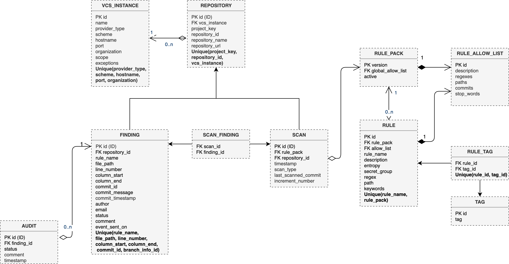

# RESC - Architecture

## VCS Scanner Worker flow diagram
The flow diagram below shows the different stages that a VCS Scanner Worker goes through and the choices it is confronted with to
come to the desired result. It first picks up a repository from the queue where it is decided, in conjunction with user input, what type of scan to run. 
If it is a base scan, a full scan of all commits will be carried out to look for secrets. Possible findings are stored inside the database along with the last scanned commit hash of the repository. An incremental scan, where the repository was scanned earlier, only looks at the commits that were made after the last scanned commit hash. The process of finding secrets and storing them in the database is similar as previously described.  

  

## Entity-Relationship data model
  