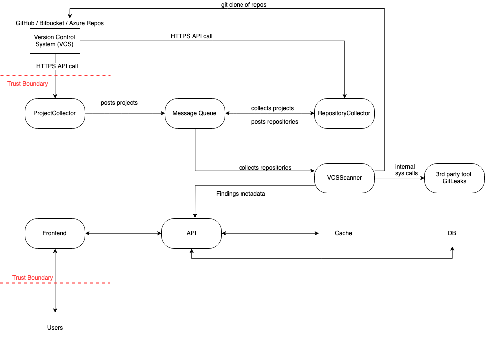

# RESC - Threat Model

We employ the [STRIDE](https://owasp.org/www-community/Threat_Modeling_Process#stride) model for threat modeling in our application development process. This systematic approach allows us to proactively identify and address potential security vulnerabilities by considering the six threat categories: Spoofing, Tampering, Repudiation, Information Disclosure, Denial of Service and Elevation of Privilege. Also, we incorporate this threat modeling as a continuous practice, ensuring that as we add new features to the application, we systematically assess and mitigate emerging security risks to maintain a robust and secure software environment.

## Attack Targets
What is an attacker interested in as ultimate or interim target?
Think of Confidentiality, Integrity, Availability and authentication, authorization, non-repudiation.
| Attack Target | Description |
| --- | --- |
| Metadata about secrets | To access sensitive information such as employee email (PII) |
| NPA credentials | To access Version Control Systems such as GitHub, Bitbucket, Azure Repos |
| Repositories information | To access source code |  

## Threat Actors
Who are more relevant Threat Actors and where do they attack from?
- script kiddies, black hat hacker
- States ('state-sponsored attacks')
- Disgruntled IT employee with privileged access
- Disgruntled employee  

## Threat Modeling Legend
| STRIDE | DESCRIPTION |
| --- | --- |
| **S**poofing | Impersonate something / someone |
| **T**ampering | Modify something on disk, network, memory etc |
| **R**epudiation | Claim that you didn’t do something |
| **I**nformation Disclosure | Reveal information to someone |
| **D**enial of Service	| Disable or slow down a service |
| **E**levation of Privileges | Act with different permissions |  

## Threat Model Diagram
  
  
## Attack Target: Project Collector  
Collects a list of all project names and feeds them to the message queue.  
| Threat | Impact | Countermeasures | Remarks |
| --- | --- | --- | --- |
| The ProjectCollector may not log or track actions properly, allowing an attacker to deny their involvement | Difficulties in tracking unauthorized activities | Implement proper logging and auditing mechanisms | Logging is used to track which projects or repositories are  queued and in the event of an issue, the error is logged for future examination |
| Sensitive data such as NPA credentials or project names might be exposed | Unauthorized access to sensitive information | Encrypt sensitive information, apply only required permissions for NPA accounts | RESC's default behaviour is to store NPA tokens as Kubernetes secrets. RESC also allows KeyVault integration, and all NPA credentials should be kept in the Vault |
| If the Docker container or its dependencies have vulnerabilities, an attacker could gain elevated privileges | Unauthorized control over the container or host system | Regularly update and patch containers, use security scanners, and follow container best practices | SAST, SCA, Infra code, and docker image scans are already part of the GitHub action pipeline for each pull request merging to main branch. Any critical finding is a build breaker and must be resolved prior to merging with the main branch |

## Attack Target: Message Queue 
Manage message queues.  
| Threat | Impact | Countermeasures | Remarks |
| --- | --- | --- | --- |
| An attacker could put fake message on queue, causing the RepositoryCollector to do incorrect processing | Unauthorized access to the message queue, potential data manipulation | Implement strong authentication and authorization mechanisms for accessing the message queue | Authentication is used to safeguard both PROECT_QUEUE and REPOSITORY_QUEUE. In RabbitMQ, we set explicit read and write permissions for each queue. Furthermore, the RabbitMQ management interface should not be accessible outside of the cluster and is already be configured with authentication. |
| Messages on the queue could be tampered with, causing incorrect processing by the RepositoryCollector | Corrupted or malicious data processed downstream, leading to potential security or functionality issues | Sign all queue messages. Validate the message signature at the RepositoryCollector and reject any message with a missing or invalid signature. Log any failed messages. Use secure communication channels between the sender and the message queue | |
| An attacker might send tampered data to queues and deny their involvement later | Difficulty in attributing actions to the responsible party | Implement auditing and logging mechanisms for actions related to the message queue | Logging is used to track which projects or repositories are  queued and in the event of an issue, the error is logged for future examination |
| Sensitive data might be intercepted or accessed by unauthorized entities. Messages could be read by an attacker at rest in the Message queue | Unauthorized access to queue messages, potential exposure of sensitive information | Encrypt sensitive information before sending it to the message queue, restrict access to the queue, and employ proper access controls | Both PROECT_QUEUE and REPOSITORY_QUEUE are protected by authentication.Each queue in RabbitMQ has explicit read and write rights. The RabbitMQ management interface should not be accessible from outside the cluster and should already be authenticated. |
| Attackers may flood the queues with a high volume of requests to disrupt its availability | Message queue unavailability, potential service disruption | Implement rate limiting, monitoring, and consider implementing message queue-specific security measures to mitigate DoS attacks | |
| Attackers could exploit vulnerabilities in the message queue system to gain unauthorized access or control | Potential compromise of the message queue, unauthorized access to project names | Regularly update and patch the message queue system, follow best practices for securing the message queue | SAST, SCA, Infra code, and docker image scans are already part of the GitHub action pipeline for each pull request merging to main branch. Any critical finding is a build breaker and must be resolved prior to merging with the main branch |

## Attack Target: Repository Collector 
Collects a list of all repository names and feeds them to the message queue.  
| Threat | Impact | Countermeasures | Remarks |
| --- | --- | --- | --- |
| The RepositoryCollector may not log or track actions properly, allowing an attacker to deny their involvement | Difficulty in attributing actions to the responsible party | Implement auditing and logging mechanisms for actions performed | Logging is used to track which projects or repositories are  queued and in the event of an issue, the error is logged for future examination |
| Sensitive data such as NPA credentials or repository names might be exposed | Unauthorized access to project and repository data, potential exposure of sensitive information | Encrypt sensitive information in transit and at rest, restrict access to the message queues, and follow best practices for securing data storage | RESC's default behaviour is to store NPA tokens as Kubernetes secrets. RESC also allows KeyVault integration, and all NPA credentials should be kept in the Vault |
| Attackers could exploit vulnerabilities in the RepositoryCollector source code or docker image to gain unauthorized access or control | Unauthorized control over the container or host system | Regularly update and patch containers, use security scanners, and follow container best practices | SAST, SCA, Infra code, and docker image scans are already part of the GitHub action pipeline for each pull request merging to main branch. Any critical finding is a build breaker and must be resolved prior to merging with the main branch |

## Attack Target: VCSScanner
Collects repository names from the message queue, clones the repository, runs a gitleaks scan, and saves the findings to the database.  
| Threat | Impact | Countermeasures | Remarks |
| --- | --- | --- | --- |
| Attackers could modify or inject malicious data while sending data to API | Corrupted or malicious data processed downstream, potentially leading to security or functionality issues | Implement data integrity checks for messages in transit, validate data received from queues, and use secure data transmission to API | |
| An attacker might alter data sent to the API and deny their involvement later | Difficulty in attributing actions to the responsible party | Implement auditing and logging mechanisms for actions performed to establish accountibility | Logging is used to track which projects or repositories are  queued and in the event of an issue, the error is logged for future examination |
| Sensitive data such as metadata related to secrets, might be intercepted or accessed by unauthorized entities during transit or via the API | Unauthorized access to secrets metadata, potential exposure of sensitive information | Encrypt sensitive information in transit, restrict access to the API | HTTPS with TLS protocol should be used to encrypt communications |
| Attackers could exploit vulnerabilities in the VCSScanner source code or docker image to gain unauthorized access or control | Unauthorized control over the container or host system | Regularly update and patch containers, use security scanners, and follow container best practices | SAST, SCA, Infra code, and docker image scans are already part of the GitHub action pipeline for each pull request merging to main branch. Any critical finding is a build breaker and must be resolved prior to merging with the main branch |

## Attack Target: Frontend & API
Users utilise the frontend to visualise metrics, projects, repositories, and findings data. API is used to interact with database.  
| Threat | Impact | Countermeasures | Remarks |
| --- | --- | --- | --- |
| Attackers might attempt to impersonate legitimate users or manipulate their identity to gain unauthorized access to the frontend and API | Unauthorized access to project and repository data, findings, or the ability to perform unauthorized actions | Secure Frontend and API endpoints by implementing strong user authentication, validate user identities | RESC uses un-authenticated mode as its default deployment strategy. The Frontend, however, can be set up with Single Sign On using PKCE (Proof Key for Code Exchange) flow. Additionally, the JWT token needs to be verified at the API end. |
| Attackers may tamper with data in transit or manipulate requests parameters sent to the API to alter finding details | Corrupted or unauthorized data modification, potential security or functionality issues | Implement data integrity checks, validate user input, and ensure secure communication with the API | HTTPS with TLS protocol should be used to encrypt communications. RESC validates data from external sources, such as APIs or user input, using Pydantic and regexes. |
| Users or attackers might deny actions taken on the frontend, such as triaging findings or leaving comments | Difficulty in attributing actions to the responsible party, potential disputes | Implement auditing and logging mechanisms for user actions to establish accountability | The audit_history table records all triaging activities |
| Sensitive project, repository and finding details might be exposed to unauthorized users or attackers | Unauthorized access to sensitive information, potential data leaks | Implement access controls, encrypt sensitive data, and follow best practices for securing data | Role-based authorization is possible in RESC via JWT token validation |
| Attackers may target the API to disrupt the availability of the service | Service unavailability, users unable to access or triage findings | Implement rate limiting, monitoring, and consider security measures to mitigate DoS attacks on the API | |
| Attackers could exploit vulnerabilities in the Frontend or API source code or docker images to gain unauthorized access or control | Unauthorized control over the container or host system | Regularly update and patch containers, use security scanners, and follow container best practices | SAST, SCA, Infra code, and docker image scans are already part of the GitHub action pipeline for each pull request merging to main branch. Any critical finding is a build breaker and must be resolved prior to merging with the main branch. |

## Attack Target: Cache
The REDIS cache is used to cache expensive database operations in order to improve performance and user experience in frontend.  
| Threat | Impact | Countermeasures | Remarks |
| --- | --- | --- | --- |
| Attackers might attempt to impersonate ligitimate users to gain unauthorized access to cache data | Sensitive data cached in cache might be exposed to unauthorized users or attackers | Implement strong authentication mechanism for Redis cache, restrict access to trusted entities and use secure communication | Authentication is already enabled in REDIS via the traditional redis.conf file. However, Access Control Lists is the recommended authentication technique in REDIS. |
| Attackers may target the Rediscache to disrupt its availability, affecting frontend performance | Cache unavailability, potential performance degradation in the frontend | Implement rate limiting, monitoring and consider security measures to mitigate DoS attacks on the Cache | |

## Attack Target: Database
The Azure SQL Edge database stores projects, repositories and findings information.
| Threat | Impact | Countermeasures | Remarks |
| --- | --- | --- | --- |
| Attackers might attempt to gain unauthorized access to the database by impersonating a legitimate user or service | Unauthorized access to database data, potential data exposure or manipulation | Implement strong authentication mechanism, restrict database access to trusted entities | The Azure SQL Edge database is safeguarded by a password-based authentication mechanism. However, the default sa user is utilised instead of a custom user with only the necessary permissions. |
| Attackers may inject malicious SQL queries through the API, potentially leading to unauthorized data access or modification | Corrupted or unauthorized data modification, potential security or functionality issues | Use parametrized queries or prepared statements in source code to prevent SQL injection attacks. Implement input validation and sanitize user inputs | RESC makes use of SQLAlchemy, which offers an object relational mapping (ORM) layer that manages parametrization and value escaping, reducing the risk of SQL injection |
| Sensitive data may be exposed due to misconfigured database permissions or vulnerabilities | Unauthorized access to sensitive information, potential data leaks | Regularly review and adjust database access controls and permissions | |
| Attackers may flood the database with requests to disrupt its availability | Service unavailability, users unable to access the system | Implement rate limiting and throttling to control the number of requests | |
| Attackers could exploit vulnerabilities in the Database docker images to gain unauthorized access or control | Unauthorized control over the container or host system | Regularly update and patch containers, use security scanners, and follow container best practices | SAST, SCA, Infra code, and docker image scans are already part of the GitHub action pipeline for each pull request merging to main branch. Any critical finding is a build breaker and must be resolved prior to merging with the main branch. |